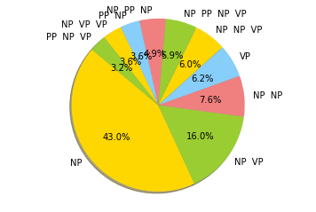
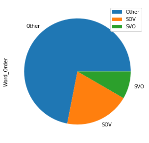

# Final Report
#### John R. Starr; jrs294@pitt.edu
Hello! As the title of this .md file suggests, this is the overall summary of my project. Here's what we're looking at today: 
- [1: The Motivation](#1:-The-Motivation)
- [2: The Research Questions](#2:-The-Research-Questions)
- [3: The Corpus](#3:-The-Corpus)
- [4: The Process](#4:-The-Process)
    - [4.1: Aligning the Data](#4.1:-Aligning-the-Data)
    - [4.2: POS-tagging & Chunking](#4.2:-POS-tagging-&-Chunking)
    - [4.3: Generalizing Chunks](#4.3:-Generalizing-Chunks)
    - [4.4: Analyzing the Data](#4.4:-Analyzing-the-Data)
    - [4.5: Issues, Failed Attempts, and Other Problematic Situations](#4.5-Issues,-Failed-Attempts,-and-Other-Problematic-Situations)
- [5: Conclusions](#5:-Conclusions)

Let's begin!

### 1: The Motivation
I just wrapped up my Persian IV class. This semester (SPR 2019), I noticed a particular trend: during classes where we would be discussing topics in English (which were infrequent!), my teacher would begin to structure her Persian in an SVO word order, even though Persian is mostly SOV. Interestingly, the inverse also found some truth -- during classes where we would use a lot of Persian, sometimes we would hesitate and accidentally say an English sentence in SOV. I wanted to investigate the former problem, seeing if there were any particular reasons that Persian would scramble to SVO.

### 2: The Research Questions
But what questions did I want to investigate? Here are a few that I was looking for:
- How often do SVO sentence structures occur in comparison to SOV ones?
- Do SVO sentences will display more complex metaphorical structures involving simile? (note: transfer of English similes to Persian sometimes creates strange errors in syntactic structures, as shown by my teacher)
- Do functional words such as مثل ("like") and که ("that") influence scrambling? If so, how?
    - Do more complex sentence structures induce SVO ordering?
        - How do factors such as "end-weight" affect Persian word ordering?

### 3: The Corpus
My corpus is the Tehran English-Persian Parallel Corpus, or TEP for short. This corpus is comprised of over 500,000 lines of English and Persian subtitles that have been taken from an online movie corpus called "[Open-subtitles](https://www.opensubtitles.org/en/search/sublanguageid-all/subs)". This project processes two of the files in the corpus: one .xml file for each language. Here's what the raw Englifh file looks like:

As you can see, the sentences are cleanly labeled by with an index. This allows for easy alignment of the data across languages, as long as you remove the header. This .xml file, along with other files about the data, are available on Github [here](https://github.com/Data-Science-for-Linguists-2019/Scrambling-in-English-to-Persian-Subtitles/tree/master/data_samples). 

This corpus is available for research and non-commercial use, as long as you cite the paper at the bottom of this document. If you are curious about the Tehran English-Persian Parallel Corpus, more information about the TEP can be found [at this link](http://opus.nlpl.eu/TEP.php).

### 4: The Process
##### 4.1: Aligning the Data
First, I had to align the two large .xml files. Unfortunately, the data had some encoding errors that had to be modified, which can be found [here](https://github.com/Data-Science-for-Linguists-2019/Scrambling-in-English-to-Persian-Subtitles/blob/master/data_samples/data_modifications.txt). If you have any questions about my modifications, please send an email to the email at the top of this page and I will respond to you as soon as I am able. 

I imported an .xml file reader to help me bypass the files' heading. Then, I lined the English and the Persian data using pandas and numpy methods to manipulate the indices provided in the .xml files themselves, in particular creating a series of the data for each language and then joining them together. After this, I created columns for the length (len), tokens and their counts (nltk.word_tokenize), and types and their counts (set) for both Persian and English. An interesting statistic is how every one-word Persian line is also a one-word English line, though the reverse is not true. Also, English had a slightly longer average sentence-length by approximately .3 characters.  No conclusions involving my research questions were made at this stage of the process. 

##### 4.2: POS-tagging & Chunking
For the Persian data, I used a POS-tagger and chunker (simplifies POS-tagged data into phrasal constituents) under the free-to-download software [hazm](https://github.com/sobhe/hazm). Hazm comes with its own models for tagging and chunking, which I tested on a few sample sentences to ensure that they would run smoothly and efficiently. Other taggers and chunkers were tried for Persian, a process in itself which will be discussed in the issues section. 

For English, I used NLTK's POS-tagger for a few reasons: it is simple to use, works pretty well, and because I had a great deal of difficulty installing other POS-taggers. Because I was unable to implement pre-installed chunkers for English due to the limitations of my computer, I ended up capitalizing on NLTK's regular expression parser to get the English chunks in working condition; to see how I did this, click [here](https://github.com/Data-Science-for-Linguists-2019/Scrambling-in-English-to-Persian-Subtitles/blob/master/notebooks/3_chunking_english.ipynb).  In the end, I never used the chunked English data, but it is still in an easily-modifiable form in case someone needs to use it. In the future, I would like to research how often the generalized word-order for the two langauges are the same, since that would be an indication of scrambling in at least one of the languages.

##### 4.3: Generalizing Chunks
To generalize chunks into either SOV, SVO, or "Other" word orders, I utilized regular expressions, defining what counted as an NP/VP and what didn't in order to build a restrictive -- but open -- word-order generalizer. First, I manipulated my Persian chunks so that 

Found [here](https://github.com/Data-Science-for-Linguists-2019/Scrambling-in-English-to-Persian-Subtitles/blob/master/notebooks/4_generalizing_chunks#Section-3:-Generalizing-Chunks-Using-Regex) 

The top ten word counts are as follows: 
.

A great deal of the data ended up being classified as "Other" ([see here](https://nbviewer.jupyter.org/github/Data-Science-for-Linguists-2019/Scrambling-in-English-to-Persian-Subtitles/blob/master/notebooks/5_data_analysis.ipynb#Section-4:-Examining-Other-Data)), which was followed by SOV and then SVO. This is not entirely surprising, since the data consists of many one-word sentences for the quick discourse necessary for subtitles; also, the default word order of Persian is SOV. The counts for the generalized word orders can be seen as follows:

##### 4.4: Analyzing the Data
Unfortuantely, analysis of my data did not provide much support for my hypothesis. Regardless, I will continue to pursue alternative methods after this semester has ended.

##### 4.5: Issues, Failed Attempts, and Other Problematic Situations
I encountered many issues with my project. Firstly, I had encoding issues with my Persian .xml file. Secondly, regular expressions are not yet my friend. They gave me lots of problems, sometimes overmatching, othertimes undermatching. Thirdly, I am not satisfied by how my chunker operated, as it made many mistakes. 
Getting tagger and chunker

### 5: Conclusions

##### References:
- M. T. Pilevar, H. Faili, and A. H. Pilevar, “TEP: Tehran English-Persian Parallel Corpus”, in proceedings of 12th International Conference on Intelligent Text Processing and Computational Linguistics (CICLing-2011)

