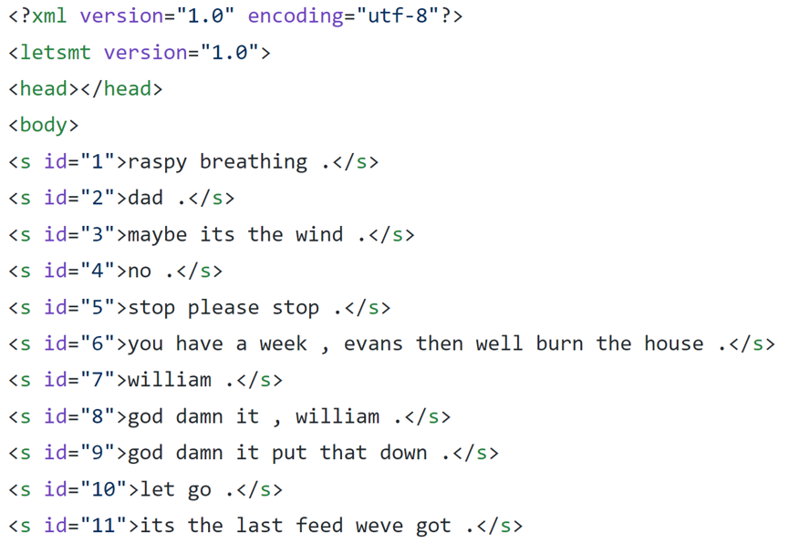

# Final Report
#### John R. Starr; jrs294@pitt.edu
Hello! As the title of this .md file suggests, this is the overall summary of my project. Here's what we're looking at today: 
- [1: The Motivation](#1:-The-Motivation)
- [2: The Research Questions](#2:-The-Research-Questions)
- [3: The Corpus](#3:-The-Corpus)
- [4: The Process](#4:-The-Process)
    - [4.1: Aligning the Data](#4.1:-Aligning-the-Data)
    - [4.2: POS-tagging & Chunking](#4.2:-POS-tagging-&-Chunking)
    - [4.3: Generalizing Chunks](#4.3:-Generalizing-Chunks)
    - [4.4: Analyzing the Data](#4.4:-Analyzing-the-Data)
- [5: Conclusions](#5:-Conclusions)

Let's begin!

### 1: The Motivation
I just wrapped up my Persian IV class. This semester (SPR 2019), I noticed a particular trend: during classes where we would be discussing topics in English (which were infrequent!), my teacher would begin to structure her Persian in an SVO word order, even though Persian is mostly SOV. Interestingly, the inverse also found some truth -- during classes where we would use a lot of Persian, sometimes we would hesitate and accidentally say an English sentence in SOV. I wanted to investigate the former problem, seeing if there were any particular reasons that Persian would scramble to SVO.

### 2: The Research Questions
But what questions did I want to investigate? Here are a few that I was looking for:
- How often do SVO sentence structures occur in comparison to SOV ones?
- Do SVO sentences will display more complex metaphorical structures involving simile? (note: transfer of English similes to Persian sometimes creates strange errors in syntactic structures, as shown by my teacher)
- Do functional words such as مثل ("like") and که ("that") influence scrambling? If so, how?
    - Do more complex sentence structures induce SVO ordering?
        - How do factors such as "end-weight" affect Persian word ordering?

### 3: The Corpus
My corpus is the Tehran English-Persian Parallel Corpus, or TEP for short. This corpus is comprised of over 500,000 lines of English and Persian subtitles that have been taken from an online movie corpus called "[Open-subtitles](https://www.opensubtitles.org/en/search/sublanguageid-all/subs)". This project processes two of the files in the corpus: one .xml file for each language. Here's what the raw Englifh file looks like:

As you can see, the sentences are cleanly labeled by with an index. This allows for easy alignment of the data across languages, as long as you remove the header. This .xml file, along with other files about the data, are available on Github [here](https://github.com/Data-Science-for-Linguists-2019/Scrambling-in-English-to-Persian-Subtitles/tree/master/data_samples). 

This corpus is available for research and non-commercial use, as long as you cite the paper at the bottom of this document. If you are curious about the Tehran English-Persian Parallel Corpus, more information about the TEP can be found [at this link](http://opus.nlpl.eu/TEP.php).

### 4: The Process
##### 4.1: Aligning the Data
First, I had to align the two large .xml files. Unfortunately, the data had some encoding errors that had to be modified, which can be found [here](https://github.com/Data-Science-for-Linguists-2019/Scrambling-in-English-to-Persian-Subtitles/blob/master/data_samples/data_modifications.txt). If you have any questions about my modifications, please send an email to the email at the top of this page and I will respond to you as soon as I am able. 

I imported an .xml file reader to help me bypass the files' heading. Then, I lined the English and the Persian data using pandas and numpy methods to manipulate the indices provided in the .xml files themselves, in particular creating a series of the data for each language and then joining them together. After this, I created columns for the length (len), tokens and their counts (nltk.word_tokenize), and types and their counts (set) for both Persian and English. An interesting statistic is how every one-word Persian line is also a one-word English line, though the reverse is not true. Also, English had a slightly longer average sentence-length by approximately .3 characters.  No conclusions involving my research questions were made at this stage of the process. 

##### 4.2: POS-tagging & Chunking
For the Persian data, I used a POS-tagger and chunker (simplifies POS-tagged data into phrasal constituents) under the free-to-download software [hazm](https://github.com/sobhe/hazm). Hazm comes with its own models for tagging and chunking, which I tested on a few sample sentences to ensure that they would run smoothly and efficiently. Other taggers and chunkers were tried for Persian, a process in itself which will be discussed in the issues section. 

For English, I used NLTK's POS-tagger for a few reasons: it is simple to use, works pretty well, and because I had a great deal of difficulty installing other POS-taggers. Because I was unable to implement pre-installed chunkers for English due to the limitations of my computer, I ended up capitalizing on NLTK's regular expression parser to get the English chunks in working condition; to see how I did this, click [here](https://nbviewer.jupyter.org/github/Data-Science-for-Linguists-2019/Scrambling-in-English-to-Persian-Subtitles/blob/master/notebooks/3_chunking_english.ipynb).  In the end, I never used the chunked English data, but it is still in an easily-modifiable form in case someone needs to use it. In the future, I would like to research how often the generalized word-order for the two langauges are the same, since that would be an indication of scrambling in at least one of the languages.

##### 4.3: Generalizing Chunks
To generalize chunks into either SOV, SVO, or "Other" word orders, I utilized regular expressions, defining what counted as an NP/VP and what didn't in order to build a restrictive -- but open -- word-order generalizer. First, I manipulated my Persian chunks so that all the Persian data and extra brackets did not exist. To get an idea of what the most common phrasal patterns were, see the following pie chart:
.

I then defined a few variables that indicated what an NP was and wasn't, what a VP was and wasn't, and what was neither an NP nor a VP (such as a PP or ADJP). Next, I created two regular expressions, one for SVO and one for SOV, that would search through 10 sample phrase patterns of varying complexity (from 'NP VP' to 'NP  ADVP  PP  VP  ADVP  NP'). When these matched all the sentences that they were supposed to, I applied the regular expressions to the data. The code for whole process of creating the regular expressions can be found [here](https://nbviewer.jupyter.org/github/Data-Science-for-Linguists-2019/Scrambling-in-English-to-Persian-Subtitles/blob/master/notebooks/4_generalizing_chunks.ipynb#Section-3:-Generalizing-Chunks-Using-Regex).

A great deal of the data ended up being classified as "Other" ([see here](https://nbviewer.jupyter.org/github/Data-Science-for-Linguists-2019/Scrambling-in-English-to-Persian-Subtitles/blob/master/notebooks/5_data_analysis.ipynb#Section-4:-Examining-Other-Data)), which was followed by SOV and then SVO. This is not entirely surprising, since the data consists of many one-word sentences for the quick discourse necessary for subtitles; also, the default word order of Persian is SOV. The overal counts for the generalized word orders can be seen as follows:

##### 4.4: Analyzing the Data
Unfortuantely, analysis of my data did not provide much support for my research questions. I did find that SOV sentences occur approximately twice as often as SVO sentences, with there being 120607 SOV sentences and 68954 SVO sentences in the dataset (though that is not accounting for the 422525 sentences that were categorized as "Other"). Also, the "Other" sentences had a much, _much_ smaller average length, which I assume to be a result of a large number of one-word and two-word lines in the corpus consisting of words like "بله" ("Yes") and "باشه" ("Okay, great!").

After briefly going through the SOV and SVO Dataframes for مثل and که, I wasn't able to recognize any patterns that would indicate these functional words play any role in scrambling. However, these words were used quite commonly in translations of sentences involving the English phrase "is like", which is a pretty obvious sign of a simile. Most importantly, it was extremely difficult to track for Persian metaphors, since there are an incredible number of them. Perhaps another DS project could be finding and/or determining metaphors and then creating a list of them; if that existed, I could very easily search for them throughout the corpus and see whether or not scrambling had occurred. 

I investigated the effect end-weight plays in Persian and found a few papers on the topic, one of which can be found [here](http://www.cssp.cnrs.fr/eiss10/eiss10_faghiri-and-samvelian.pdf). The results of these papers suggest that the longer constituent (not necessarily an NP) is placed first, "as is common in OV languages like Japanese and Korean" (Faghiri & Samvelian, 2014), though the placement of the object depends on how determined it is. However, the object continues to be put before the verb phrase. Despite not being the best piece of evidence, it should be mentioned that my teacher tends to put the more complex ADJPs/ADVPs/PPs prior to the object, though all constituents appear before the verb in most situations.

Regardless of these analyses, I will continue to pursue alternative methods of approaching my data after this semester has ended.

### 5: Conclusions
I learned a great deal from this project, though it may have not ended up being super informative. That being said, I do want to work with big data in the future, and this was a great (though tiny) stepping stone into that big, big world. 

I encountered some issues over the past few months, most of which will be briefly outlined here. Firstly, I had encoding issues with my Persian .xml file that required editing by hand. Secondly, I had a great deal of difficulty finding a Persian tagger and chunker that would work on my system (Windows seems to be much unpreferred to Linux!). I found [a wonderful list of resources](https://github.com/mhbashari/awesome-persian-nlp-ir); even after meeting with a few people who are much more knowledgeable about installing and operating new software, the only nlp resource that I could successfully figure out how to use was hazm. Thirdly, I am not satisfied by how my Persian chunker operated, as it made many mistakes. It may have been better to break up the tokens into either their lemmas or their morphological components (I am leaning towards the latter, since lemmas may eliminate some clarifying information regarding subjects), so that the chunker could more accurately see what constituents belonged where. Fourthly, regular expressions are not yet my friend. They gave me lots of problems at a few different steps of this project, sometimes overmatching, sometimes undermatching. I know that regular expressions take a long time to master, but that doesn't change the fact that I would've liked to have been more effective at implementing them.

Admittedly, I feel that I tried to tackle a surprsingly-complex problem that I was not yet prepared for. If I had known what I know now, I would have pivoted my project in a different, more tractable direction. Some ideas that I have in mind for future projects:
- Examining particular syntactic constituents (similar to "is like") that are easily searchable and have limited contexts
- Creating a "sentence creator" by using various machine learning models that would automatically generate sentences around a certain subject
- Attempting to summarize the movies based on the dialogue alone

Well, that's it, I think. آن همیشه است. Thank you for reading my report!

##### References:
- M. T. Pilevar, H. Faili, and A. H. Pilevar, “TEP: Tehran English-Persian Parallel Corpus”, in proceedings of 12th International Conference on Intelligent Text Processing and Computational Linguistics (CICLing-2011)

